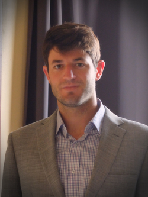
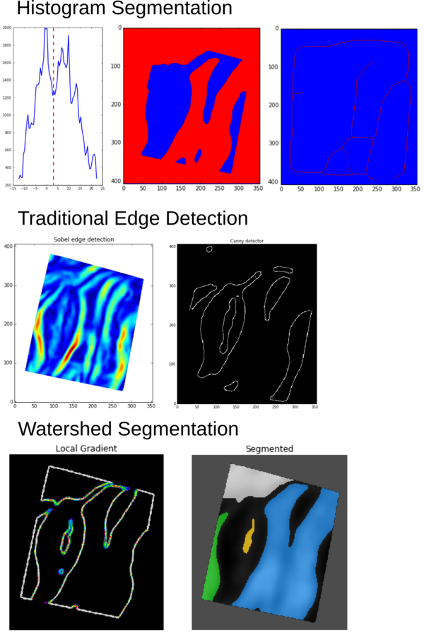
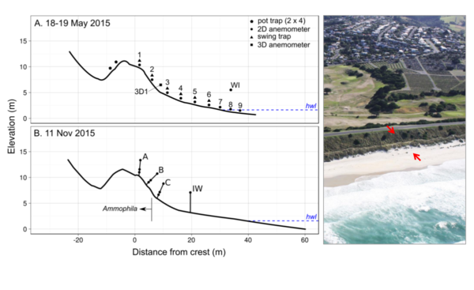
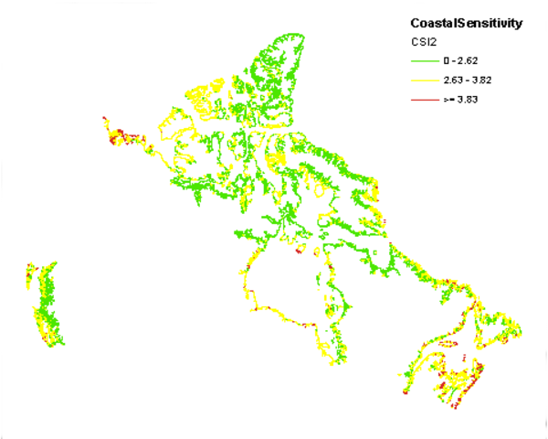
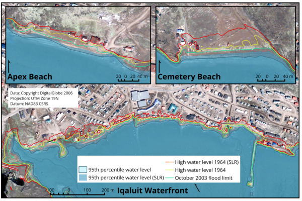
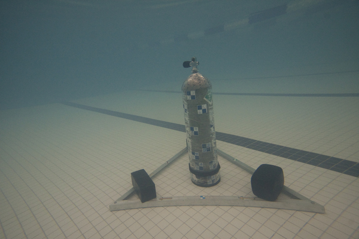

# Scott V. Hatcher's Professional Portfolio

# Personal Statement

I am a pragmatic and personable coastal geographer. I strive to complement my
technical skills with an excellence in communicative and collaborative
qualities. My training has provided me with a grounding in modern GIS and
remote sensing technologies, and my experience in research has given me the
analytical abilities inherent in applied geomorphological study. I am now fully
committed to the research of geospatial applications to regional climate change
adaptation.

# Goals

**Short** - Provide geospatial services in areas of coastal hazards and
adaptation planning.

**Long** - Work to assist the adaptation of coastal populations to projected
climatic change using the powerful decision support provided by geospatial
technology.

# Contact Info

[scott.v.hatcher (at) gmail (dot) com](mailto://scott.v.hatcher@gmail.com)

[CV](./web/files/SVHatcher_CV.pdf)

[Resume](./web/files/SVHatcher_resume.pdf)

[LinkedIn](https://ca.linkedin.com/in/svhatcher)

[ResearchGate](https://www.researchgate.net/profile/Scott_Hatcher)

[Twitter](https://www.twitter.com/svHatch)

# Projects

## 3D scanning archaeological rock carvings

For the purpose of preservation, as well as to facilitate analysis, some rock
carvings made on the face of a cave were scanned at very high resolution using
a white-light scanner. The carvings are located on the Chatham Islands, which
are a group of islands east of New Zealand. This was done by the Archaeology
and Surveying departments of the University of Otago in Dunedin, New Zealand.
My job was to attempt to automate the process of detecting the carvings from
the surveying data in order to quickly map their layout on the carving face.

  * Age of the rock face carvings: ~300 years
  * Total number of individual survey points taken by the scanner: > 100 million
  * Poster: [Download link](https://www.dropbox.com/s/jbat6o8cva9fz4x/SVHatcher_ESASummerSchool_poster.pdf?dl=0)

## Storm effects on an urban coastal dune

I was involved in a project that aimed to quantify the effect of highly oblique
winds in transporting sand over a coastal dune. This coastal dune, located on
the southern coast of Dunedin, New Zealand, is adjacent to municipal lands, and
is bordered by a large road made of backfill. The project used in situ
measurement techniques to quantify the effects of steering and acceleration of
the regional winds due to the local topography of the dune.

  * Published proceedings: [download link](http://www.jcronline.org/doi/pdf/10.2112/SI75-059.1)
  * Maximum measured sand movement: 1200 kg/hr/m^2 (about a bathtub every hour)

## CanCoast - providing a national estimate of coastal vulnerability

The goal of the CanCoast project is to improve upon the existing Coastal
Vulnerability Index (CVI) from Shaw et.al. (1998) using updated information on
Geology, Coastline shape, permafrost, and socioeconomic variables. To do this,
a GIS with all relevant layers was created, and then a new formula for
calculating a vulnerability index was developed.

## Assisting coastal planning in the Inuit communities of Northern Labrador (Memorial University, 2012-2013)

The community plans for the Inuit towns within Nunatsiavut, in northern
Labrador, rely on planners from Ottawa. This presents challenges when it comes
to community assets that are cultural and unmapped. The planners wanted to
incorporate this information into community plans, as well as fill in data gaps
to do with projected climatic change. A partnership with Memorial University
allowed this problem to be tackled.

  * Population of Nunatsiavut: 2,160
  * Executive summary of project: [download link](http://nainresearchcentre.com/wp-content/uploads/2013/04/SakKija%CC%82nginnatuk-Nunalik_Learning-from-the-coast-executive-summary_low-res.pdf)
  * Poster: [download link](http://nainresearchcentre.com/wp-content/uploads/2013/04/ArcticNetPoster_finalWeb.pdf)

## Coastal Hazards in a rapidly expanding Arctic urban centre (M.Sc. 2011-2013)  

The city of Iqaluit needed an assessment of coastal hazards within Koojesse
Inlet, the main inlet servicing the city, in order to incorporate proper
planning into its five year plan, as well as it's long-term climate change
adaptation plan.

  * Published journal article: [download link](http://arctic.journalhosting.ucalgary.ca/arctic/index.php/arctic/article/view/4526)
  * Published GSC Open-File report: [download link](http://publications.gc.ca/collections/collection_2016/rncan-nrcan/M183-2-7653-eng.pdf)
  * Vertical height of tides in Koojesse Inlet: 12.3 m

## Underwater photogrammetry at the Centre of Geographic Sciences

As part of my final project I attempted a 3D model of a scuba tank underwater
using oblqiue photogrammetry. This is very common place now (structure from
motion has advanced rapidly since then), but at the time I had a lot of fun
diving into new avenues of photogrammetry.

  * Depth of water: 3 m
  * Camera used: Canon 20D, Sigma 10-22mm lens
  * Practical use for a 3D model of a scuba tank: None

## Revisiting the story of Hippalus, the great ancient navigator (B.A. in History, 2005-2009)

Hippalus has retained a seat in those remembered from ancient history as a
great navigator. It was he who cleverly began sailing due East once leaving the
Gulf of Aden and arriving on the Western coast of India, when all others
assumed this would be a suicide mission. His fame even gave his name to monsoon
winds that made his feat possible. The evidence we have, however, for his
existence is faint, but his story could help elucidate the way mythology shaped
the ancient Graeco-Roman world.

  * Time of the year the "Hippalus wind blows":
  * Distance of the journey from the Gulf of Aden to Mumbai:
  * Total number of times Hippalus is mentioned in the primary sources:
  * [Slideshare presentation link](http://www.slideshare.net/ScottHatcher5/the-birth-of-the-monsoon-winds)
  * Published journal article: [download link](http://www.tandfonline.com/doi/full/10.1179/0082288413Z.00000000015)

## Personal photography

I am an amateur photographer, enjoying taking photos of nature and of funny
situations. I keep my portfolio on [flickr](https://www.flickr.com/gp/143183184@N04/yHT3X4)
